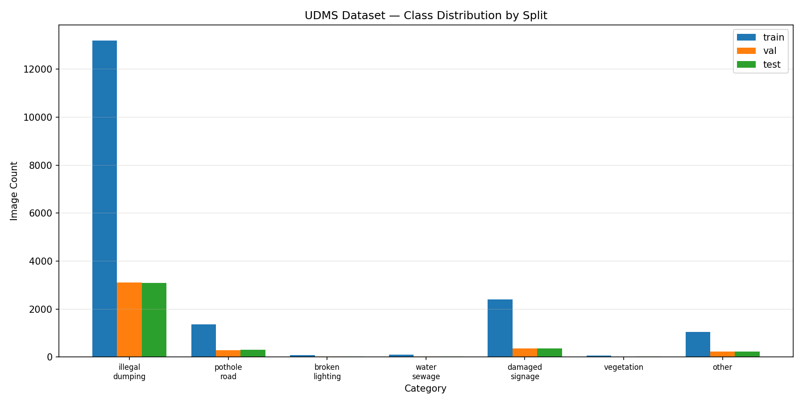
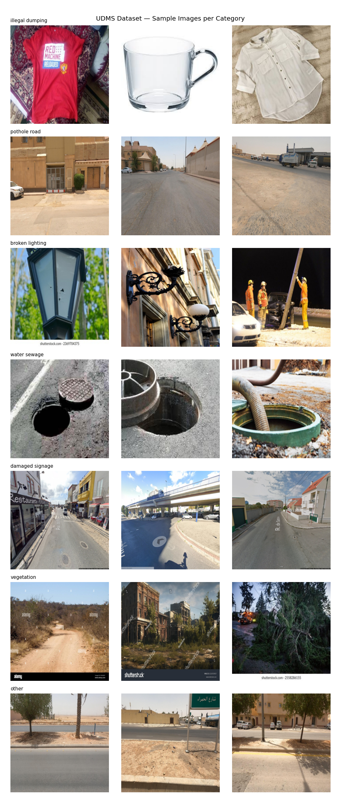

# UDMS Dataset Report

Generated from: `C:\Users\pc\Documents\udms-image-classifier\data\processed`

## Class Distribution



| Category | Train | Val | Test | Total |
|----------|------:|----:|-----:|------:|
| illegal_dumping | 13188 | 3112 | 3097 | 19397 |
| pothole_road | 1357 | 291 | 292 | 1940 |
| broken_lighting | 83 | 18 | 18 | 119 |
| water_sewage | 103 | 22 | 23 | 148 |
| damaged_signage | 2407 | 357 | 358 | 3122 |
| vegetation | 56 | 12 | 13 | 81 |
| other | 1035 | 222 | 223 | 1480 |
| **TOTAL** | | | | **26287** |

## Distribution Bar Chart

```
illegal_dumping      |████████████████████████████████████████| 19397
pothole_road         |████░░░░░░░░░░░░░░░░░░░░░░░░░░░░░░░░░░░░| 1940
broken_lighting      |░░░░░░░░░░░░░░░░░░░░░░░░░░░░░░░░░░░░░░░░| 119
water_sewage         |░░░░░░░░░░░░░░░░░░░░░░░░░░░░░░░░░░░░░░░░| 148
damaged_signage      |██████░░░░░░░░░░░░░░░░░░░░░░░░░░░░░░░░░░| 3122
vegetation           |░░░░░░░░░░░░░░░░░░░░░░░░░░░░░░░░░░░░░░░░| 81
other                |███░░░░░░░░░░░░░░░░░░░░░░░░░░░░░░░░░░░░░| 1480
```

## Sample Images




## ✅ All categories meet minimum thresholds.
